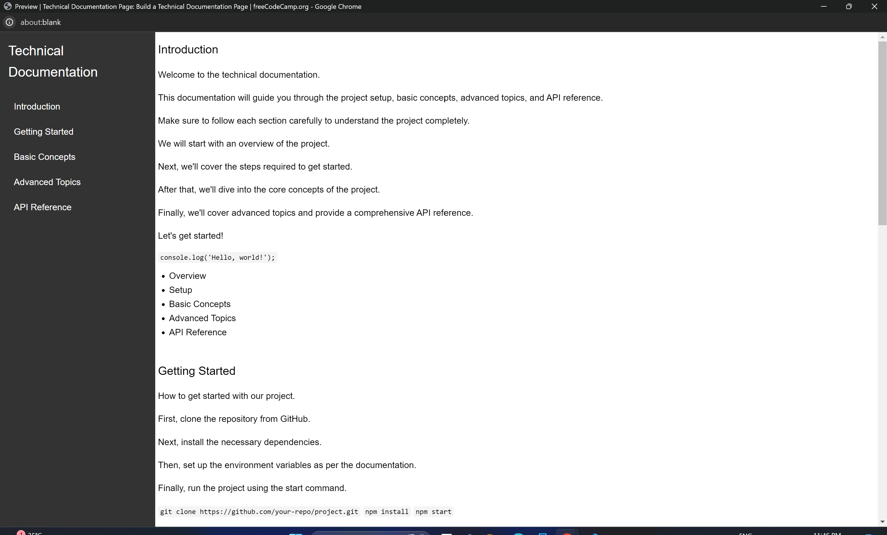

# Technical Documentation Page

## Overview

**Technical-Documentation-Page** is a user-friendly platform designed to facilitate the creation, management, and presentation of technical documentation. Whether you're a developer, technical writer, or project manager, this tool helps you create clear, organized, and accessible documentation for software, APIs, and technical processes.

## Preview

## Features

- **Intuitive Interface**: Easy-to-use interface for seamless documentation.
- **Version Control**: Keep track of document changes and revisions.
- **Search Functionality**: Quickly find the information you need.
- **Customizable Templates**: Use and create templates to maintain consistency.
- **Collaboration Tools**: Enable team collaboration with shared access and editing capabilities.
- **Responsive Design**: Access and edit documentation on any device.

## Getting Started

### Prerequisites

Ensure you have the following installed:

- [Node.js](https://nodejs.org/) (version 14.x or higher)
- [npm](https://www.npmjs.com/) (version 6.x or higher)

### Installation

1. Clone the repository:
    
    git clone https://github.com/Yashi-Singh-1/Technical-Documentation-Page.git
    

2. Navigate to the project directory:
    
    cd Technical-Documentation-Page

3. Install the dependencies:
    
    npm install
    

### Running the Application

To start the development server, run:

npm start

Open your browser and go to http://localhost:3000 to see the application in action.

## Usage

### Creating Documentation

1. **Add a New Document**: Click on "New Document" and fill in the required fields.
2. **Organize Content**: Use the drag-and-drop interface to organize your documentation structure.
3. **Edit and Save**: Use the rich text editor to format your content and save your changes.

### Managing Versions

1. **Track Changes**: View the version history to see changes over time.
2. **Restore Versions**: Revert to previous versions if needed.

### Customizing Templates

1. **Create Templates**: Design your own templates for consistent formatting.
2. **Apply Templates**: Use templates to standardize the look and feel of your documents.

## Contributing

We welcome contributions! Follow these steps to contribute:

1. Fork the repository.
2. Create a new branch (git checkout -b feature/your-feature).
3. Commit your changes (git commit -m 'Add some feature').
4. Push to the branch (git push origin feature/your-feature).
5. Open a pull request.

## Contact

For any questions or suggestions, please contact:

- **Yashi Singh**
- [yashiartist009@gmail.com](mailto:yashiartist009@gmail.com)
- [GitHub](https://github.com/Yashi-Singh-1)
